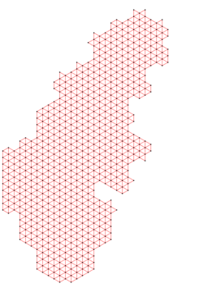
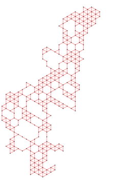
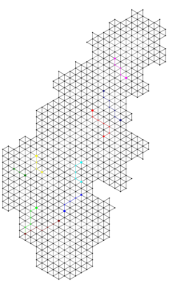

# Utils

## How to use them

### mesh2graph.py

This script utility uses a mesh geoJSON file and generates a graph in two formats: dot and svg.




```sh
./mesh2graph.py data/mesh_roads_epsg3857.geojson
```

### clustergraph.py

This script utility uses a point geoJSON file and a mesh geoJSON file and generates a JSON with all the points clustered using the mesh.

```sh
./clustergraph.py data/students_epsg3857.geojson data/mesh_full_epsg3857.geojson | jq -r > data/students_epsg3857.json
```

### routes.py

This script utility generates a SVG that represents all the routes:

```sh
./routes.py routes.json data/schools_epsg3857.json data/students_epsg3857.json data/mesh_full_epsg3857.geojson data/mesh_roads_epsg3857.geojson
```


